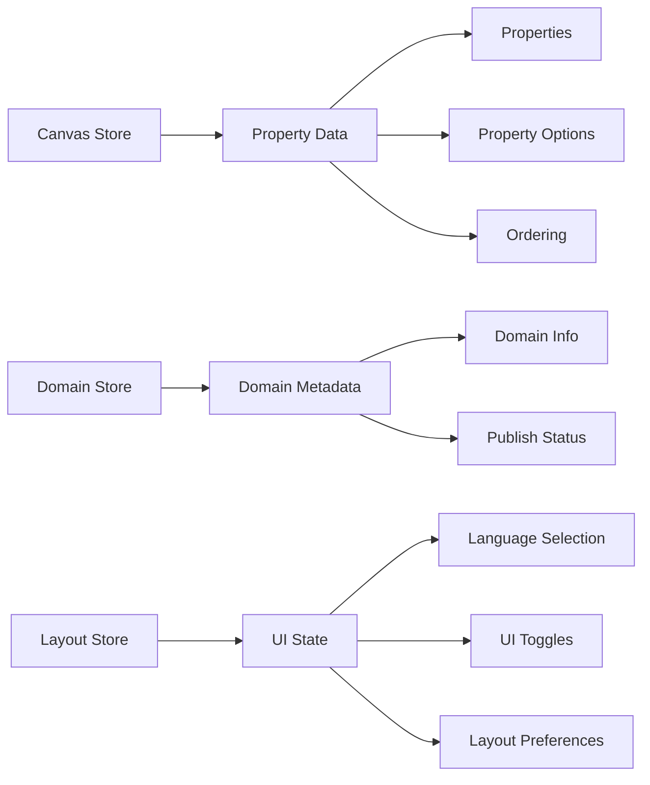
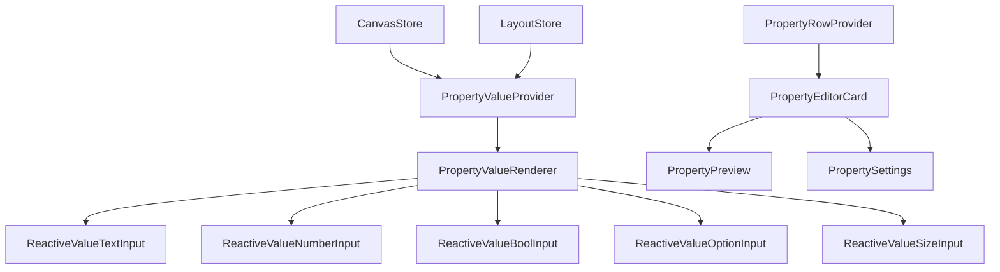

# NextJS Dynamic Forms - CMS Builder

A production-ready dynamic form builder built with Next.js 15, Zustand, Immer, and React Context. This system provides a flexible, reactive architecture for creating and managing dynamic forms with multi-language support, atomic components, and real-time updates.

## 🎯 Core Concepts

### Domain-Property-Record-Value Architecture

The system follows a hierarchical data model:

- **Domain**: Represents a collection schema (e.g., "Products", "Users", "Events")
- **Property**: Defines field schemas with types, constraints, and metadata
- **Record**: Individual documents within a domain
- **Value**: Actual data for each property in a record

### Code System

The `code` field serves as a unique identifier within each domain, enabling:

- Conditional logic in forms
- Dynamic field relationships
- Code-based property references
- Template generation

## 🏗️ Architecture Overview

### Store Architecture

The application uses a multi-store Zustand architecture with Immer for immutable updates:



### Reactive Component System

Components are built with a reactive architecture using Context providers:



## 🚀 Key Features

### 1. Atomic Reactive Components

Components automatically update when:

- Property metadata changes
- Translation locale switches
- Value updates occur
- Store state changes

```tsx
// Example: Reactive text input that updates automatically
<PropertyValueProvider propertyId={propertyId} value={value} mode={ValueInputMode.ENTRY}>
  <ReactiveValueTextInput customPlaceholder="Enter product name..." floatingLabel={true} />
</PropertyValueProvider>
```

### 2. Multi-Language Support

Built-in internationalization with reactive updates:

```tsx
// Components automatically update when language changes
const label = usePropertyLabel(); // Reactive to translation changes
const placeholder = usePropertyPlaceholder(); // Updates with locale
```

### 3. Type-Safe Property System

Support for multiple property types with type-specific validation:

- **Text**: Single/multi-line with character limits
- **Number**: Integer/float with min/max constraints
- **Boolean**: Checkbox/switch variants
- **Option**: Single/multi-select with custom options
- **Size**: Numeric value with unit selection

### 4. Immer-Powered State Management

Efficient immutable updates using Immer:

```tsx
// Clean, mutable-style updates with immutable guarantees
updateProperty(propertyId, (draft) => {
  draft.name.en = "New Name";
  draft.meta.min = 0;
  draft.meta.max = 100;
});
```

## 📦 Technology Stack

- **Framework**: Next.js 15 with App Router
- **State Management**: Zustand with Immer
- **UI Components**: Radix UI + Tailwind CSS
- **Internationalization**: next-intl
- **Type Safety**: TypeScript
- **Form Handling**: React Hook Form + Zod
- **Testing**: Jest + React Testing Library

## 🏛️ Project Structure

```
src/
├── packages/
│   └── cms/
│       ├── modules/
│       │   ├── domain-editor/          # Domain editing interface
│       │   │   ├── stores/             # Zustand stores
│       │   │   ├── contexts/           # React contexts
│       │   │   ├── hooks/              # Custom hooks
│       │   │   └── components/         # UI components
│       │   ├── properties/             # Property management
│       │   ├── values/                 # Value input components
│       │   ├── records/                # Record management
│       │   └── domains/                # Domain management
│       └── data/                       # Data layer
└── app/                               # Next.js app router
```

## 🔧 Getting Started

### Prerequisites

- Node.js 18+
- Yarn package manager

### Installation

```bash
# Clone the repository
git clone <repository-url>
cd nextjs-dynamic-forms

# Install dependencies
yarn install

# Set up environment variables
cp .env.example .env.local

# Run development server
yarn dev
```

## 🎨 Usage Examples

### Creating a Domain

```tsx
// Define a product domain
const productDomain = {
  id: "products",
  name: { en: "Products", ru: "Продукты" },
  is_active: true,
  meta: {
    description: "E-commerce product catalog",
  },
};
```

### Adding Properties

```tsx
// Add a text property
const nameProperty = {
  id: "product-name",
  code: "name",
  type: "text",
  name: { en: "Product Name", ru: "Название продукта" },
  is_required: true,
  meta: {
    multiline: false,
    max: 100,
  },
};

// Add a number property
const priceProperty = {
  id: "product-price",
  code: "price",
  type: "number",
  name: { en: "Price", ru: "Цена" },
  meta: {
    min: 0,
    max: 10000,
    integer: false,
  },
};
```

### Using Reactive Components

```tsx
// Component automatically updates when property changes
function ProductForm({ propertyId, value }) {
  return (
    <PropertyValueProvider propertyId={propertyId} value={value} mode={ValueInputMode.ENTRY}>
      <FormFieldLayout>
        <PropertyValueRenderer />
      </FormFieldLayout>
    </PropertyValueProvider>
  );
}
```

## 🔄 Store Patterns

### Canvas Store (Property Data)

```tsx
// Access property data reactively
const property = usePropertyDisplay(propertyId, (p) => p.name.en);

// Update property with Immer
const { updateProperty } = usePropertyCRUD();
updateProperty(propertyId, (draft) => {
  draft.name.en = "Updated Name";
});
```

### Layout Store (UI State)

```tsx
// Access UI state
const { currentTranslation, showPreview } = useLayoutStore();

// Update UI state
const { setCurrentTranslation, setShowPreview } = useLayoutStore();
```

## 🧪 Testing

```bash
# Run tests
yarn test

# Run tests in watch mode
yarn test:watch

# Run tests with coverage
yarn test --coverage
```

## 📚 API Reference

### Property Types

```typescript
type PropertyType = "text" | "number" | "bool" | "option" | "size";

interface Property {
  id: string;
  code: string;
  type: PropertyType;
  name: LocalizedText;
  description?: LocalizedText;
  is_required: boolean;
  is_private: boolean;
  meta?: PropertyMeta;
  options?: PropertyOption[];
}
```

### Store Hooks

```typescript
// Property data access
usePropertyDisplay(propertyId, selector);
useStaticProperty(propertyId, selector);
useReactiveValue(options);

// UI state access
useLayoutStore(selector);
useDomainStore(selector);

// CRUD operations
usePropertyCRUD();
usePropertyOptionCRUD();
```

## 🚀 Performance Optimizations

1. **Selective Reactivity**: Components only re-render when relevant data changes
2. **Memoized Selectors**: Zustand selectors are memoized to prevent unnecessary updates
3. **Strategic Hydration**: Store hydration boundaries at container level
4. **Immer Efficiency**: Immutable updates without manual object spreading
5. **Context Optimization**: Context values are memoized to prevent child re-renders

## 🔒 Data Integrity

- **Conflict Detection**: Automatic detection of concurrent data changes
- **Deletion Tracking**: Proper tracking of deleted items for database cleanup
- **Validation**: Zod schemas ensure data consistency
- **Persistence**: Zustand persistence with domain-specific keys

## 🌐 Internationalization

- **Multi-language Support**: Built-in support for multiple locales
- **Reactive Translations**: Components update automatically when language changes
- **Localized Metadata**: Property names, descriptions, and placeholders support i18n

## 🤝 Contributing

1. Fork the repository
2. Create a feature branch
3. Make your changes
4. Add tests for new functionality
5. Submit a pull request

## 📄 License

This project is licensed under the MIT License - see the LICENSE file for details.

## 🆘 Support

For support and questions:

- Create an issue in the repository
- Check the documentation in the `/docs` folder
- Review the code comments for implementation details

---

**Built with ❤️ using Next.js 15, Zustand, and Immer**
