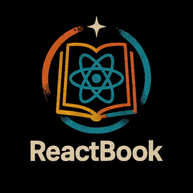

ew

# @shredbx/reactbook-web v0.0.1

## What & Why

This is the **React / Next.js knowledgebase app** powered by ReactBook.  
It provides a place to explore React-related experiments, patterns, documentation, and live demos.

## When to Use

- To browse ReactBook patterns in an interactive web format
- To test and visualize reusable React patterns and slices
- To experiment with MCP integrations, examples, and documentation

## When Not to Use

- For isolated React experiments not intended for documentation
- If you only need the ReactBook code directly (without the web UI)

## How It Works

- Built with **Next.js** as the frontend framework
- Fetches and renders ReactBook patterns, examples, and docs
- Hosts demos and experiments in a single workspace

## Examples / Use-cases

- Viewing React patterns with live previews
- Running demos for Zustand-based state slices
- Using the web portal as a documentation-first React knowledgebase

## References

- [ReactBook core code](/src/packages/reactbook/README.md)
