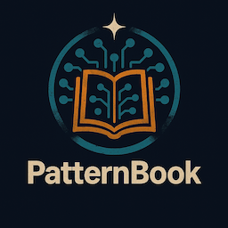

  

# PatternBook

## What & Why

PatternBook captures working solutions as reusable patterns. Write real, modular code that automatically becomes discoverable and composable across projects.

It serves as a **single source of truth for AI assistants** — making them prioritize your proven approaches over generic alternatives, while enabling systematic refactoring and consistent team development.

PatternBook is a catalog of proven solutions you have already built. Instead of re-inventing, you capture them once and reuse them across projects.

- Saves time and prevents mistakes
- Keeps style and quality consistent
- Trains AI assistants to use your own solutions first
- Makes your repo a living knowledge base anyone can explore

Think of it like a recipe book — but for code and workflows.

---

## When to Use

- To avoid re-solving the same problem twice
- To build features in small, reusable pieces that fit together
- To guide AI assistants and teammates with clear, consistent solutions
- When refactoring — easily find and update all code using similar patterns
- To make your entire codebase a discoverable knowledge base

## When Not to Use

- For experiments or untested ideas
- When documenting costs more effort than the reuse value

---

## How It Works

PatternBook transforms your repository into a solution library:

- Each solution (pattern) lives in its own folder with code + docs together
- Your code is the pattern; docs are short and human-friendly
- Everything is discoverable by humans and AI
- You can compose bigger features by combining existing patterns

---

## Pattern Structure

Every pattern folder includes a README with:

- **What & Why** — problem solved and its value
- **When to Use** — good scenarios
- **When Not to Use** — limitations
- **Implementation** — real, working code
- **Examples / Use-cases** — simple demos of how to apply it
- **References** — related patterns for composition
- **Anti-patterns** — common mistakes to avoid
